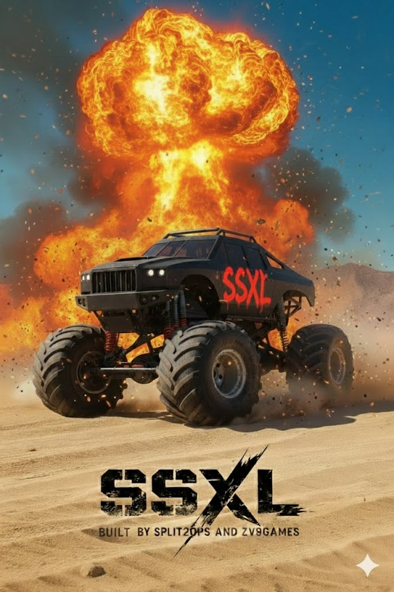

# SSXL Monolith

> _“SSXL is not a plugin. It’s a weapon.”_

**The SSXL Monolith** is a quantum-forged, low-level game kernel core — built to write power into form.  
It is the seed of a new generation of game engines: modular, procedural, and forged for scale.

SSXL is the foundation for building AAA-scale experiences — open-world, multiplayer, persistent, and alive.

---

## ⚙️ What Is SSXL?

SSXL is the **core kernel** of a new game engine architecture.  
It is engine-agnostic, written in Rust, and designed to scale into a full-stack engine capable of powering:

- Massive procedural worlds  
- Real-time multiplayer systems  
- Persistent simulation layers  
- Modular runtime logic  
- Cross-platform deployment  

SSXL is the **segway** between indie tools and AAA ambition.

---

## 🧱 Current Status

- Core kernel in development  
- Source is public, but buried — only the meek will find the monolith  
- Procedural generation, async sync layers, and FFI bridges underway  
- No bindings. No altar. Only signal.

---

## 🌀 Philosophy

> _“The grid is not given. It is written.”_

SSXL is built on the belief that engines should be **modular**, **transparent**, and **ritualistic**.  
Every subsystem is a signal. Every signal is a choice.  
We don’t hide complexity — we **harness** it.

---

## 📜 License

SSXL is currently under a **restrictive license** while the core is forged.  
No commercial use. No derivatives. No closed forks.  
The monolith must remain whole — for now.

---

## 🕯️ Final Note

If you’re reading this, you’re early.  
If you’re building with this, you’re brave.  
If you’re forking this, you’re part of it.

> _“The monolith does not move. It waits.  
> The signal does not shout. It hums.  
> The grid is not found. It is written.”_
